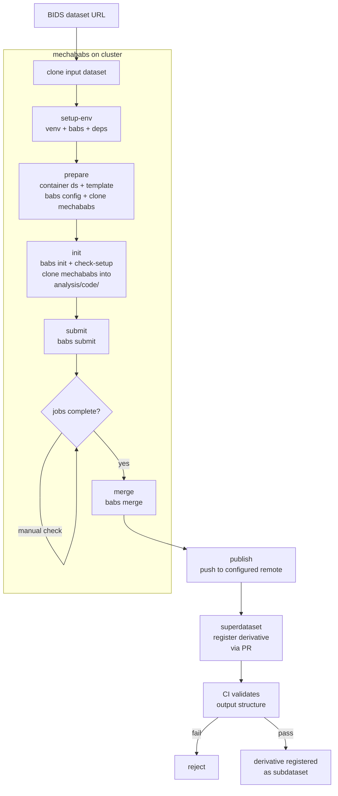
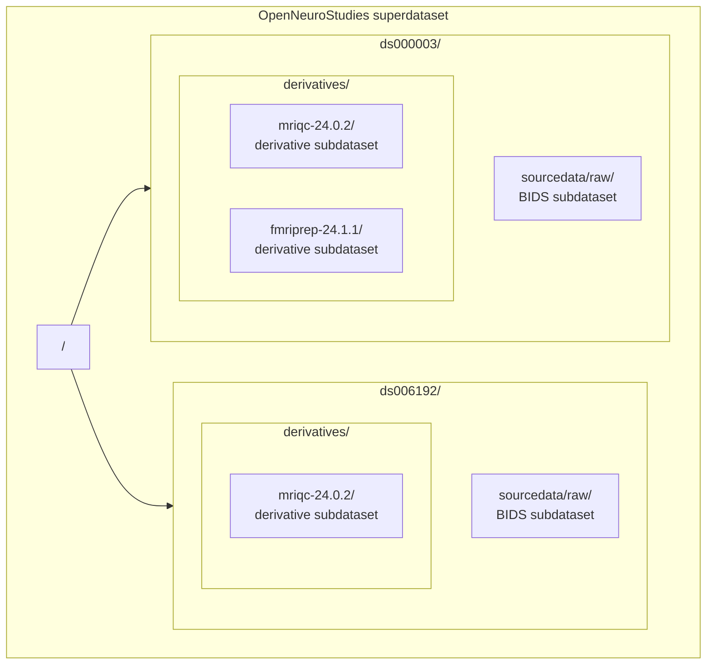
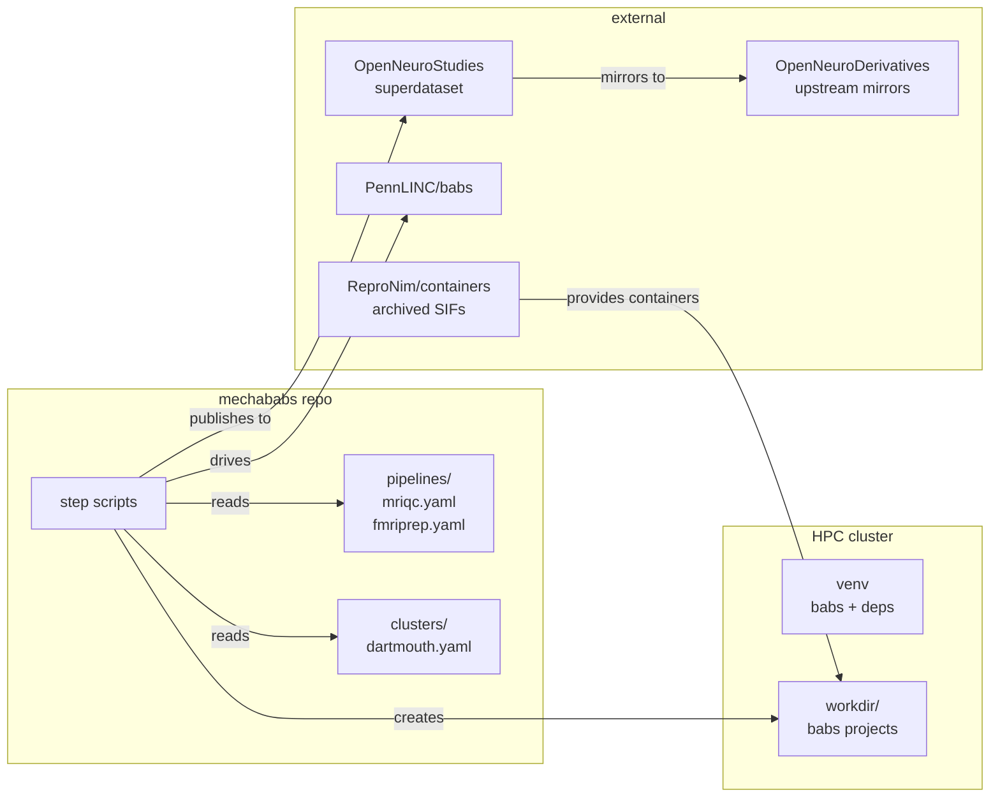

# mechababs diagrams

## Processing flow

```mermaid
flowchart TD
    A[BIDS dataset URL] --> B[clone input dataset]

    subgraph mechababs [mechababs on cluster]
        B --> C[setup-env\nvenv + babs + deps]
        C --> D[prepare\ncontainer ds + template\nbabs config + clone mechababs]
        D --> E[init\nbabs init + check-setup\nclone mechababs into\nanalysis/code/]
        E --> F[submit\nbabs submit]
        F --> G{jobs complete?}
        G -->|manual check| G
        G -->|yes| H[merge\nbabs merge]
    end

    H --> I[publish\npush to configured remote]
    I --> J[superdataset\nregister derivative\nvia PR]
    J --> K[CI validates\noutput structure]
    K -->|fail| L[reject]
    K -->|pass| M[derivative registered\nas subdataset]
```

## Superdataset structure (bids-study layout)

```mermaid
graph TD
    subgraph superdataset [OpenNeuroStudies superdataset]
        ROOT["/"]

        subgraph ds003 [ds000003/]
            SD003[sourcedata/raw/\nBIDS subdataset]
            subgraph derivs003 [derivatives/]
                MQ003[mriqc-24.0.2/\nderivative subdataset]
                FP003[fmriprep-24.1.1/\nderivative subdataset]
            end
        end

        subgraph ds006 [ds006192/]
            SD006[sourcedata/raw/\nBIDS subdataset]
            subgraph derivs006 [derivatives/]
                MQ006[mriqc-24.0.2/\nderivative subdataset]
            end
        end
    end

    ROOT --> ds003
    ROOT --> ds006
```

## Component map

```mermaid
graph LR
    subgraph external [external]
        ONS[OpenNeuroStudies\nsuperdataset]
        OND[OpenNeuroDerivatives\nupstream mirrors]
        BABS_REPO[PennLINC/babs]
        REPRONIM[ReproNim/containers\narchived SIFs]
    end

    subgraph mechababs_repo [mechababs repo]
        MB_TOOL[step scripts]
        PIPE[pipelines/\nmriqc.yaml\nfmriprep.yaml]
        CLUST[clusters/\ndartmouth.yaml]
    end

    subgraph cluster [HPC cluster]
        VENV[venv\nbabs + deps]
        WORKDIR[workdir/\nbabs projects]
    end

    MB_TOOL -->|drives| BABS_REPO
    MB_TOOL -->|reads| PIPE
    MB_TOOL -->|reads| CLUST
    MB_TOOL -->|creates| WORKDIR
    MB_TOOL -->|publishes to| ONS
    ONS -->|mirrors to| OND
    REPRONIM -->|provides containers| WORKDIR
```
